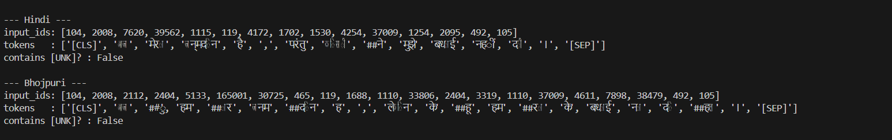
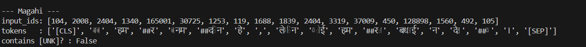
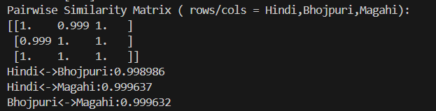
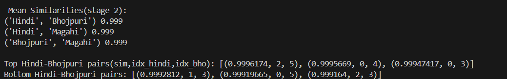
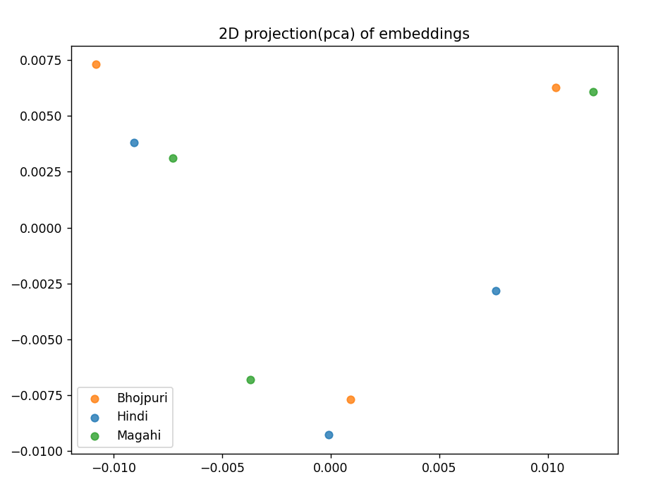

## Overview
This project explores the semantic similarity between language groups in this case Indo-Aryan Languages. The languages chosen for this are Bhojpuri, Magahi and Hindi. The model MuRil(a multilingual LLM trained on major Indian Languages) is used to see whether similar embeddings for sentences across these three languages are produced when the meanings are equivalent.

Notably, Bhojpuri and Magahi aren't part of the training corpus of MuRil. Which makes the test for semantic generalization pretty interesting.

## Motivation
Bhojpuri and Magahi are two of the primary languages that are spoken in Bihar, situated in the north-east part of India. These languages are pretty low resource and aren't recognized as a scheduled language in the Eighth Schedule of the Indian Constitution. Therefore, it is crucial to give these languages a platform to be recognized and be preserved with the help of multilingual LLMs.

The project was born with the question:

>*Can MuRil produce embeddings/infer meaning for unseen languages based on its knowledge of a high resource language in the same corpora?*

In simple words, if a person knows Hindi can they understand or at least partially recognize a language like Bhojpuri even though they have never learnt it formally.

## Methodology
(1) Generating embeddings using MuRIL
- Each sentence (Hindi/Bhojpuri/Magahi) is fed into MuRIL.
- MuRIL gives a 768-dimensional vector(CLS embedding) for each sentence.
- These vectors represent meaning in numerical form.

(2) Comparing embeddings using cosine similarity
- If two sentence have similar meanings, their vectors should be close.
- This closeness is measured by cosine similarity.
- Values near 1.0 mean that meaning is very similar whereas values near 0 mean unrelated.

(3) Visualizing the embeddings using PCA
- Mapping the embeddings is difficult because they are in a 768 dimensional form
- To rectify this PCA is used which converts such big dimensions into 2 dimensions so that it's easily comprehensible by us.
- This also forms clusters on a scatter plot.
- If the sentences in Bhojpuri,Magahi and Hindi cluster together then it means that the model generalizes their semantics.

## Example Sentences
| Hindi                                    |  Bhojpuri                                       |  Magahi                                        |
| ---------------------------------------- | ----------------------------------------------- |  --------------------------------------------- |
|आज मेरा जन्मदिन है,परंतु किसीने मुझे बधाई नहीं दी। |आजु हमार जनमदिन ह, लेकिन केहू हमरा के बधाई ना दिहल। | आज हमर जनमदिन हे, लेकिन कोई हमरा बधाई न देलक।  |
| बिजली चली गई।                            | बिजली बंद हो गईल।                                 | बिजली गुल हो गेल।                                |
| तुम कैसे हो?                               | तू कइसे हव?                                       | कइसन हें?                                      |

## Results
### Tokenizer Output
The image shows the input_ids for all the languages consisting of the valid tokens.

The token list shows the properly segmented subwords.

The [UNK]?= False depicts that MuRIL's tokenizer can tokenize all three languages without unknown tokens.

This means that Bhojpuri and Magahi aren't foreign to MuRIL and since they share a lot of vocabulary with Hindi the model can represent them smoothly at the token level. So instead of rejecting them it treats them as "Hindi-like languages"

### Pairwise Similarity
The numbers that are generated here are extremely high(0.999) closer to 1. This basically means that the model generates identical embeddings for these languages.

This result is expected since these languages share identical meaning and structure. Plus MuRIL knows Hindi pretty well so it collapses these languages in the same vector.

### Mean Similarities
In stage 2, three sentences per language was used on the basis of which mean similarity was generated and it produced pretty high values. Meaning that the embeddings are still collapsing into the same point.

### PCA 2D Plot
The plot captures the fact that the embeddings are nearly identical, that differences exist but are extremely small.
The languages do not form separate clusters, even with 3 samples per language, the cluster is tight.
In simple words, in the PCA space the model sees the languages as the same.

## Limitations
- The use of CLS embeddings may inflate similarity scores.
- The dataset is small (3 sentences per language).
- PCA with limited samples provides only qualitative insight.

## Future Work
- Use alternative pooling strategies(like mean pooling)
- Evaluate on larger and more diverse datasets
- Use Hindi as a pivot language
- Include additional Indo-Aryan languages

"# Semantic-Generalization-of-Bhojpuri-and-Magahi-in-MuRIL" 
"# Semantic-Generalization-of-Bhojpuri-and-Magahi-in-MuRIL" 
